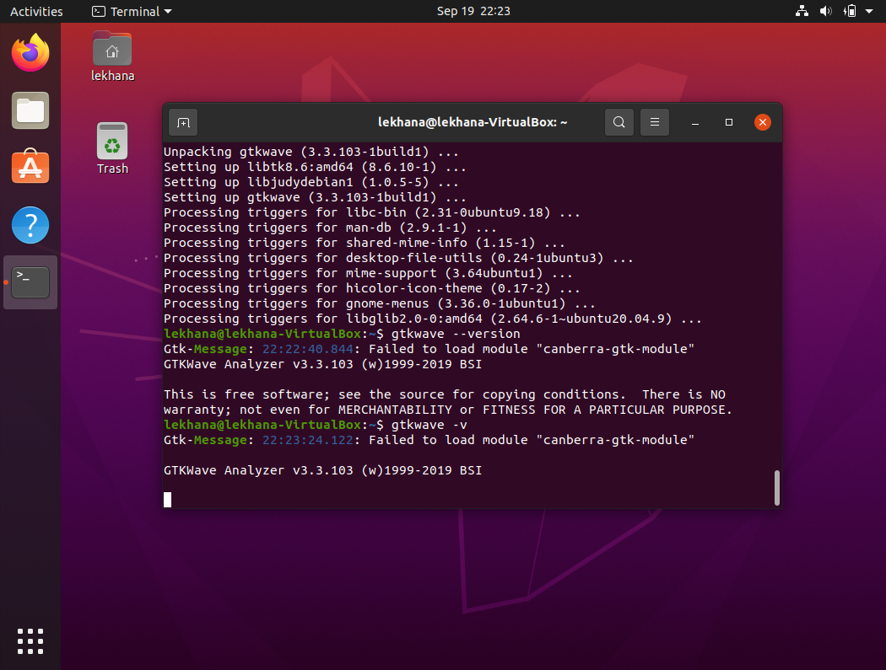

# 📐 Digital VLSI SoC Design and Planning  

This week focused on understanding the **complete RISC-V SoC design and tapeout flow** — from compiling C applications to final fabrication.  
The session provided a structured overview of **specifications, RTL design, integration, verification, synthesis, and physical design**, along with their importance in real-world applications like IoT devices and consumer electronics.  

---

## 📖 Flow Overview  

The journey of a chip from software to silicon begins with compiling C applications using **GCC**, followed by specification verification and chip modeling. The process then moves into **RTL architecture design**, integrating processor cores, peripherals, and analog IPs, along with SoC-level functional verification. After generating the **gate-level netlist through synthesis**, the design enters the **physical design phase**, which includes floorplanning, placement, CTS, and routing. Finally, **signoff checks (DRC/LVS)** ensure manufacturability before fabrication, leading to deployment in products like Arduino boards, IoT devices, and consumer electronics.  


---

## 🔹 Stepwise Flow  

- Compile C apps → GCC → test & verify  
- Finalize specs and chip modeling  
- RTL architecture → processor + peripherals + macros + analog IPs  
- SoC integration and block-level verification  
- Generate gate-level netlist (synthesis)  
- Floorplanning → placement → CTS → routing  
- Final tapeout checks (DRC/LVS)  
- Fabrication & application (Arduino boards, IoT, consumer electronics)  

---

## 🔑 Key Takeaways  

- Learned the **big-picture flow of SoC design**: from high-level C apps down to silicon.  
- Understood how **firmware, RTL, analog, and verification** connect in a real project.

---
# 🔧 Task 2 – Tools Installation & Environment Setup

To begin the RISC-V SoC design journey, the first step was to set up a **virtualized Linux environment** and install the essential open-source EDA tools. This ensures a stable workspace for **synthesis, simulation, and waveform analysis** throughout the program.

---

## 🖥️ Virtual Machine Setup

A Virtual Machine (VM) was configured using **Oracle VirtualBox**:

🔗 [Download VirtualBox](https://www.virtualbox.org/wiki/Downloads)

| Specification       | Details        |
|--------------------|----------------|
| Operating System    | Ubuntu 20.04+  |
| RAM                 | 6 GB           |
| Storage             | 50 GB HDD      |
| vCPUs               | 4              |

💡 *This setup provides sufficient resources for running open-source tools smoothly.*

---

## ⚙️ Tools Installation & Verification

The following open-source tools were installed successfully:

---

🔹 1. Yosys – RTL Synthesis Tool

Purpose: Converts RTL code into gate-level representations.


**Installation Commands:**  
```bash
sudo apt-get update
git clone https://github.com/YosysHQ/yosys.git
cd yosys
sudo apt install make   # Install make if missing
sudo apt-get install build-essential clang bison flex \
    libreadline-dev gawk tcl-dev libffi-dev git \
    graphviz xdot pkg-config python3 libboost-system-dev \
    libboost-python-dev libboost-filesystem-dev zlib1g-dev
git submodule update --init --recursive
make
sudo make install
```
## 📷 **Installation Verification**


</div>

---
🔹 2. Icarus Verilog – Verilog Simulator

Purpose: Compiles and simulates Verilog designs for functional verification.
**Installation Commands:**  
```bash
sudo apt-get update
sudo apt-get install iverilog

# Verify Icarus Verilog
iverilog -V

```
## 📷 **Installation Verification**


</div>

---
🔹 3. GTKWave – Waveform Viewer

Purpose: Visualizes simulation output (VCD/FST waveforms).
**Installation Commands:**  
```bash
sudo apt-get update
sudo apt-get install gtkwave

# Verify GTKWave
gtkwave --version


```
## 📷 **Installation Verification**


</div>

---
📌 With these tools installed (Yosys, Icarus Verilog, GTKWave), the environment is now ready for RTL design, synthesis, simulation, and waveform analysis.


